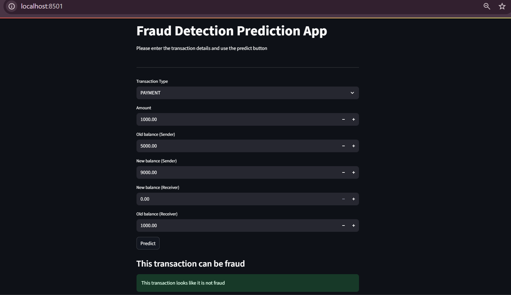

# 🔍 Fraud Detection in Financial Transactions

This is a machine learning-based web application to **detect fraudulent financial transactions** using transaction data. It uses a trained model to predict whether a given transaction is fraudulent or not, based on user inputs like transaction type, amount, and account balances.

<p align="center">
  
" alt="App Screenshot" width="600">
</p>

---
app link : https://fraud-detection-in-financial-transactions-zabi.streamlit.app/
## 📌 Table of Contents

- [Overview](#overview)
- [Project Structure](#project-structure)
- [Tech Stack](#tech-stack)
- [Setup Instructions](#setup-instructions)
- [How to Run](#how-to-run)
- [Model Training (Notebook)](#model-training-notebook)
- [Screenshots](#screenshots)
- [Future Enhancements](#future-enhancements)

---

## 🧾 Overview

The goal of this project is to identify fraudulent transactions based on patterns found in historical data. It provides an intuitive **Streamlit-based UI** where users can enter transaction details and get real-time predictions using a trained **Random Forest classifier**.

---

## 🗂️ Project Structure

FRAUD DETECTION/

├── .vscode/                         # VS Code configs

├── AIML Dataset.csv                # Raw transaction dataset

├── analysis_model.ipynb            # Jupyter Notebook for training and analysis

├── fraud_detection_pipeline.pkl    # Trained ML model

└── fraud_detection.py              # Streamlit frontend app

## ⚙️ Tech Stack

* **Frontend**: [Streamlit](https://streamlit.io/)
* **Backend / ML**: Python, Pandas, Scikit-learn, Random Forest, Joblib
* **Visualization**: Seaborn, Matplotlib
* **Model Storage**: `joblib` (for saving the trained model)

---

## 🚀 Setup Instructions

1. **Clone the Repository**

   ```bash
   git clone https://github.com/yourusername/fraud-detection-app.git
   cd fraud-detection-app

2. **Install Dependencies**

   ```bash
   pip install -r requirements.txt
   ```

   Or manually install:

   ```bash
   pip install pandas numpy seaborn matplotlib scikit-learn streamlit joblib
   ```

3. **Run the App**

   ```bash
   python -m streamlit run fraud_detection.py
   ```

4. **Open in Browser**

   * Navigate to: `http://localhost:8501`

---

## 💡 How it Works

* Users enter transaction details (type, amount, sender/receiver balances).
* The input is sent to the trained model (`fraud_detection_pipeline.pkl`).
* The model returns a prediction:

  * `Fraud`: Transaction may be malicious
  * `Not Fraud`: Transaction appears legitimate

---

## 📚 Model Training (Notebook)

The file `analysis_model.ipynb` includes:

* Data cleaning
* Label encoding
* Exploratory Data Analysis (EDA)
* Training using `RandomForestClassifier`
* Evaluation using accuracy & classification report
* Exporting model with `joblib`

---

## 🖼️ Screenshots

**Streamlit App UI**

<p align="center">
  
</p>

**Prediction Output**

<p align="center">
  
</p>

---

## 🔮 Future Enhancements

* Show prediction probabilities/confidence
* Add feature importance visualizations
* Log transaction history for review
* Add batch prediction feature
* Use more advanced models (e.g., XGBoost, LSTM for time-series)

---

## 👨‍💻 Author

**Zabi**
Python Developer | AIML Enthusiast
Feel free to connect or contribute!

---

## 📄 License

This project is licensed under the [MIT License](LICENSE).

````

---

### ✅ Optional Tips:
- Create a `screenshots/` folder and move your two screenshot PNGs there.
- Update the GitHub repo link and author name.
- Add a `requirements.txt` using:

```bash
pip freeze > requirements.txt
````


